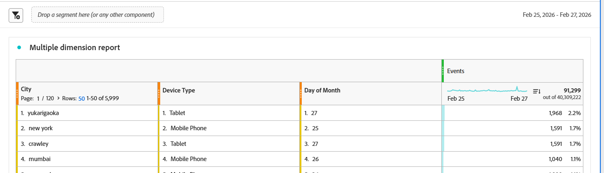
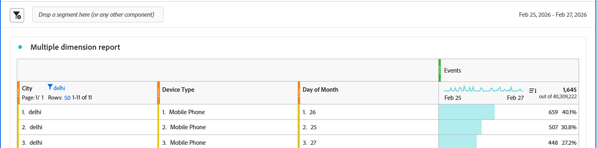

# Multiple dimension reporting

This guide describes key report features available with the Customer Journey Analytics Report API, including:

- Multiple dimensions in a single request

- Dimension-level search

- Multi-column sorting


## Multiple dimensions in a single request

With the Custonmer Journey Analtyics Report API, you can request data across multiple dimensions simultaneously in a single report request. This enhancement changes how reports are structured and queried. Rather than retrieving one dimension at a time and nesting [breakdowns](https://developer.adobe.com/analytics-apis/docs/2.0/guides/endpoints/reports/breakdowns/) vertically to analyze combinations, you can specify up to **five** dimensions in a single request and receive a result of concatenated dimension objects. Multiple dimension reporting is designed to solve a common reporting challenge: understanding which *combinations* of dimension values drive outcomes, without requiring multiple API calls, post-processing, or manual joins. For more information on this capability and how each array of dimension items behaves as a concatenated list of dimensions, see [Multiple Dimension Columns](https://experienceleague.adobe.com/en/docs/analytics-platform/using/cja-workspace/visualizations/freeform-table/freeform-table-multidimensions).

### Multiple dimensions array

The POST Report endpoint accepts a `dimensions` array of objects where each object includes a name and a `dimensionColumnId`--a user-defined identifier. The array structure provides the foundation for multi-dimension reporting, dimension-level search, and advanced sorting.


#### Dimension column IDs

Every dimension (and metric) can be assigned a column ID. These IDs can have the following characteristics:

- Be specified by the user 
- Be any unique value (UUID, number, string)
- Be used to map both sorting rules and search rules

If the user does not provide column IDs, the system will auto‑assign positional IDs. Explicit IDs are recommended as a best practice.

### Example multiple dimension request

The following example shows a free-form table in Customer Journey Analytics Workspace with multiple dimensions in one row. Below the visualization, a JSON fragment shows a matching request for the results shown in that table. The example shows both the dimensions array and the dimension conlumn IDs as described above.





```json

    "dimensions": [
        {
            "id": "variables/placeContext.geo.city",
            "dimensionColumnId": "a111ef1",
            "nonesBehavior": "exclude-nones"
        },
        {
            "id": "variables/device.typeID.global-classify-string._globallookupscja.lookupID.5f76432e4c7588194b1f6150._globallookupscja.deviceType",
            "dimensionColumnId": "a222kl2",
            "nonesBehavior": "exclude-nones"
        },
        {
            "id": "variables/timepartdayofmonth",
            "dimensionColumnId": "a333ri3",
            "nonesBehavior": "return-nones"
        }
    ],
    
```

#### Example details

The dimensions array above shows the following:

The IDs of the dimensions include the terms `city`, `device`, and `dayofmonth`.
The column IDs of the dimensions, in the same order, are `a111ef1a`, `a222kl2`, and `a333ri3`.


## Dimension-level search

With dimension-level search, you can search within specific dimensions instead of globally across an entire report. This works with the following conditions:

- Each dimension includes a search object
- Search objects contain a `clause` parameter
- The `clause` parameter is provided a text match with the word `CONTAINS`.
- Dimensions can also be searched by Dimension Column IDs


### Example dimension search

The following example shows a free-form table in Customer Journey Analytics Workspace with a dimension text search filter applied for `dehli`. Below the visualization is an example JSON fragment showing how the search is specified.





```json
 
        {
            "id": "variables/placeContext.geo.city",
            "dimensionColumnId": "0",
            "search": {
                "clause": "( CONTAINS 'delhi' )"
            },
            "nonesBehavior": "exclude-nones"
        },
```

#### Example details

The `city` dimension above shows the `clause` parameter with a text match after the word `CONTAINS`.


## Multi-column sorting

In Customer Journey Analytics, you can sort multiple columns of both dimensions and metrics. You can also mix dimensions and metrics in the same sort definition, or sort array. Each sort object is reference by `componentType` and `columnId`. For the `ascending` parameter, specify a boolean `true` to sort by ascending values and `false` to sort by descending values. The example request fragment below shows two dimensions-- one to be sorted in ascending order and another to be sorted in descending order.

```json

"settings": {
    "countRepeatInstances": true,
    "includeAnnotations": true,
    "limit": 50,
    "page": 0,
    "sort": [
        {
            "componentType": "dimension",
            "columnId": "a111ef1",
            "ascending": true
        },
        {
            "componentType": "dimension",
            "columnId": "a222kl2",
            "ascending": false
        }
    ]
}

```

<InlineAlert variant="info" slots="text" />

Segments are still applied globally at the report level, not per dimension.


## Errors and Constraints

1. Dimension Relation Errors: Dimensions must be related. Requests to combine unrelated dimensions in a single request will return an error. 

2. Too Many Combinations Errors: If too many dimensions produce an excessive number of row combinations, the system may reject the request due to scale limitations. The resulting error indicates the report is too complex.
